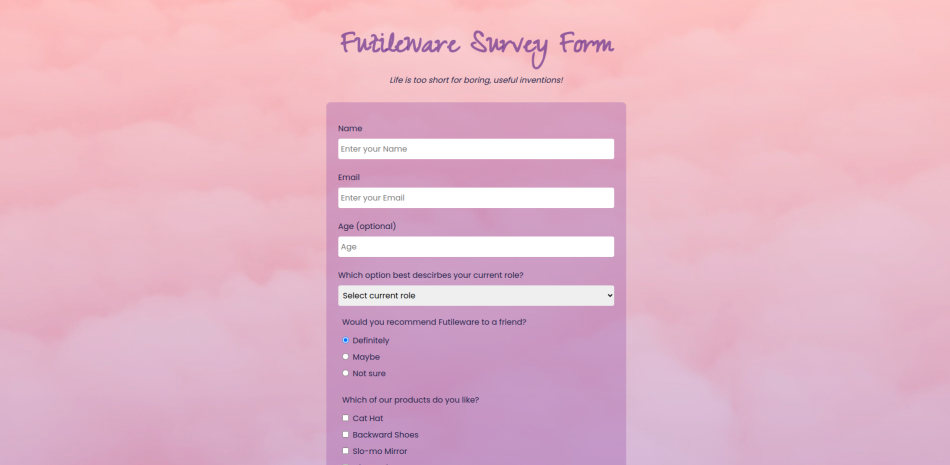

# Futileware Survey Form

This project demonstrates a survey form for Futileware built using HTML and CSS as part of the freeCodeCamp Responsive Web Design course.

## Screenshots

## Credits

#### Images

Pink Clouds by [Madison Inouye](https://www.pexels.com/@mdsnmdsnmdsn/), via [Pexels](https://www.pexels.com/)

## License

This project is licensed under the terms of the [GPL](https://www.gnu.org/licenses/gpl-3.0.en.html) open source license.
